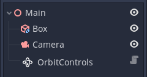
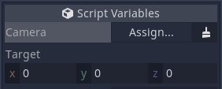

# Godot Orbit Controls

🚧 In Development 🚧

This Plugin adds Orbit Controls to the Godot Game Engine.
> Inspired by the Orbit Controls of [three.js](https://threejs.org/docs/#examples/en/controls/OrbitControls)

<p align="center">

</p>

# Installation

Clone the repository
```
git clone https://github.com/LucaJunge/godot-orbit-controls.git
```

Copy the `addons/orbit-controls` to your `addons` folder in your project.

Enable the plugin in the `Project Settings`.

# Usage

To use the plugin in your project set up an example like this, with the OrbitControls in your scene tree.

<p align="center">

</p>

Click on `Assign` to select your `Camera` from the scene tree. This will be the camera that moves around in your scene.


You can also set a `Target` which the camera will orbit.

<p align="center">

</p>
