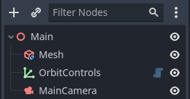
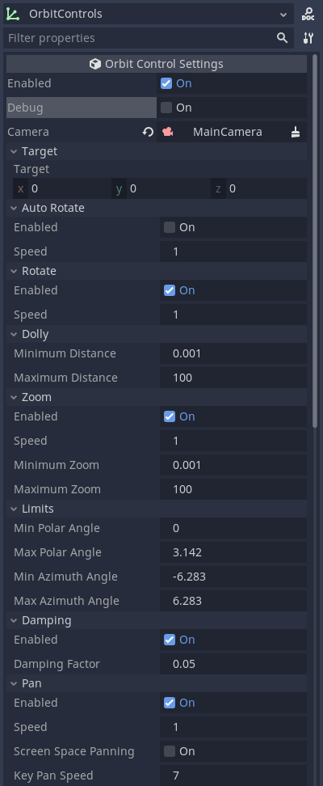

# Godot Orbit Controls

This plugin adds Orbit Controls to the Godot Game Engine.

The screenshot below is from the live demo which can be visited here:  
[https://lucajunge.github.io/godot-orbit-controls/build/index.html](https://lucajunge.github.io/godot-orbit-controls/build/index.html)


# Features

| **Feature**    | **Available with Mouse** | **Available with Touch** |
| -------------- | :----------------------: | :----------------------: |
| **Rotating**   |           [x]            |           [x]            |
| **Panning**    |           [x]            |           [x]            |
| **Dolly Zoom** |           [x]            |           [x]            |

Other features unrelated to the input method include:

- Enabling and disabling the controls (useful for cutscenes or transitions)
- Displaying debug information
- Specifying the target to rotate around
- Setting minimum and maximum distance for zooming
- Setting limits for horizontal and vertical rotation
- Enabling and disabling zooming, rotation, panning and damping
- Setting speeds for rotating, zooming and panning

# Installation

Clone the repository

```
git clone https://github.com/LucaJunge/godot-orbit-controls.git
```

Copy the `addons/orbit-controls` to your `addons` folder in your project.

Enable the plugin in the `Project Settings`.

# Usage

To use the plugin in your project add the  `OrbitControls` node to your scene.  
An example scene looks like this:



To configure the add-on, take a look at the inspector.  
In the `Camera` slot, click `Assign` to select your camera from the current scene tree. This will be the camera that moves around in your scene.

You can also set a `Vector3` as the `Target` which the camera will orbit and adjust settings (not all settings implemented yet):



# Acknowledgement

This plugin is a GDScript port of the Orbit Controls in [three.js](https://github.com/mrdoob/three.js/blob/master/examples/jsm/controls/OrbitControls.js).
It tries to mirror the features present and adapts the events and signals to match GDScripts capabilities.
