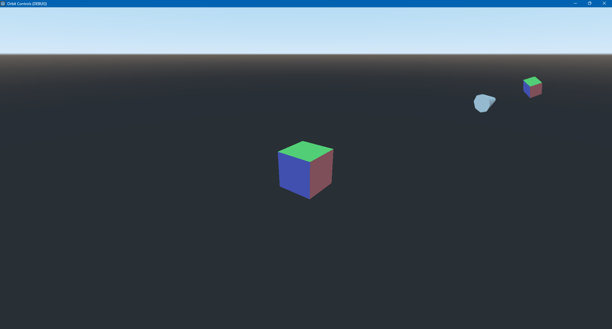

# Godot Orbit Controls

🚧 In Development 🚧

This plugin adds Orbit Controls to the Godot Game Engine.

See the live demo [here](https://lucajunge.github.io/godot-orbit-controls/build/index.html)

<p align="center">

</p>

# Installation

Clone the repository

```
git clone https://github.com/LucaJunge/godot-orbit-controls.git
```

Copy the `addons/orbit-controls` to your `addons` folder in your project.

Enable the plugin in the `Project Settings`.

# Usage

To use the plugin in your project add the `Orbit Controls` node to your scene.

Click on `Assign` to select your camera from the scene tree. This will be the camera that moves around in your scene.

You can also set a `Target` which the camera will orbit.

# Acknowledgement

This plugin is a GDScript adaption of the Orbit Controls in [three.js](https://github.com/mrdoob/three.js/blob/master/examples/jsm/controls/OrbitControls.js)
