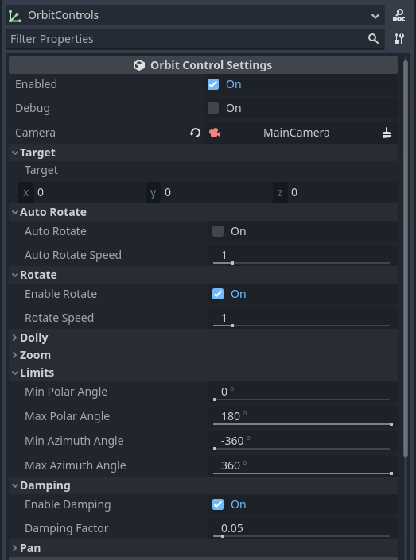

This plugin adds Orbit Controls to the Godot Game Engine.  
Based on the Orbit Controls of [three.js](https://threejs.org/docs/#examples/en/controls/OrbitControls)  

# Live Demo
Test the live demo and features at [https://lucajunge.github.io/godot_orbit_controls/build/index.html](https://lucajunge.github.io/godot_orbit_controls/build/index.html)

# Features

- **Rotation, Panning, Dolly Zoom**
- **Enabling** and **Disabling** the controls - useful for cutscenes or transitions
- Specifying the **target** to rotate around
- Setting **Minimum and Maximum Distance** for zooming
- Setting **Horizontal and Vertical Limits** for rotation
- Enabling and Disabling Zooming, Rotation, Panning and Damping individually
- Setting speeds for rotation, zooming and panning

# Installation

## Asset Library

The plugin is available in the Asset Library for Godot 4.  
Search for `Orbit Controls` in the Asset Library and click on `Download`. After it finished downloading, click `Install` on the newly opened window.  

Dont forget to enable the plugin in the `Project Settings > Plugins > Orbit Controls > ☑ Enable`.


## Manual Installation

1. Clone the repository

```bash
git clone https://github.com/LucaJunge/godot-orbit-controls.git
```

2. Copy the `addons/orbit-controls` to your `addons` folder in your project.

3. Enable the plugin in the `Project Settings > Plugins > Orbit Controls > ☑ Enable`.

# Usage

## Adding the Orbit Controls to the scene

You can add the  `OrbitControls` as a new node to your scene.  
An example scene coud look like this:


## Configuration

Take a look at the inspector for possible configuration options.  
In the `Camera` slot, click `Assign` to select your camera from the current scene tree. This will be the camera that moves around in your scene.

You can also set a `Vector3` as the `Target` which the camera will orbit:

